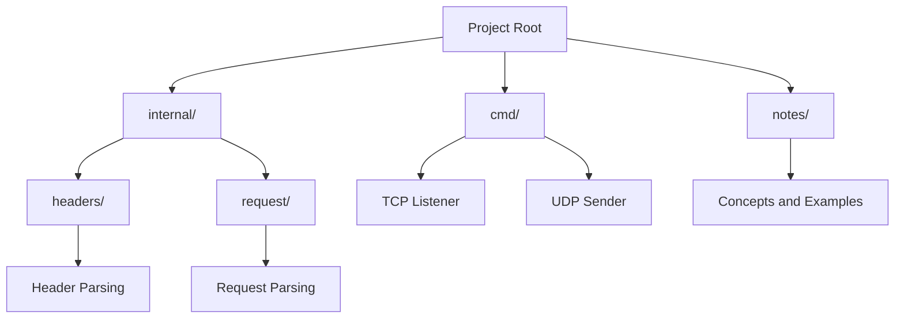

# HTTP from TCP: A Learning Project

## **Project Overview**
This project is designed to help engineers understand how HTTP works over TCP by building a simplified HTTP server and client from scratch. It focuses on parsing HTTP requests, handling TCP connections, and implementing basic HTTP features. The goal is to bridge the gap between theoretical knowledge and practical implementation.

## **Who Is This For?**
- Engineers with a background in Python who are transitioning to Go.
- Fresh graduates (BE or similar) who want to deepen their understanding of networking and HTTP.
- Anyone curious about how HTTP operates at a lower level.

## **Why Go?**
Go is a modern, efficient, and easy-to-learn language, especially for engineers with Python experience. Its simplicity and built-in support for networking make it an excellent choice for this project. The transition from Python to Go is straightforward, and this project minimizes the learning curve by focusing on practical examples.

## **What Will You Learn?**
1. **TCP Basics**: Understand how TCP connections are established and managed.
2. **HTTP Protocol**: Learn how HTTP requests and responses are structured and transmitted.
3. **Go Networking**: Use Go's `net` package to handle TCP connections.
4. **Parsing and Validation**: Implement parsers for HTTP request lines and headers.
5. **Concurrency**: Handle multiple connections simultaneously using Go's goroutines.

## **Project Structure**
- **`cmd/`**: Contains the main applications for the TCP listener and UDP sender.
- **`internal/headers/`**: Handles HTTP header parsing and validation.
- **`internal/request/`**: Manages HTTP request parsing and state.
- **`notes/`**: Includes detailed explanations and examples for concepts like TCP, HTTP, and file reading in Go.

## **Project Structure Diagram**

## **How to Get Started**
1. **Familiarize Yourself with Go**:
   - Install Go: [https://go.dev/dl/](https://go.dev/dl/)
   - Complete the Go Tour: [https://go.dev/tour/](https://go.dev/tour/)
2. **Explore the Codebase**:
   - Start with the `notes/` directory for conceptual understanding.
   - Review the `cmd/` directory to see how the main applications are structured.
3. **Run the Project**:
   - Use `go run` to execute the TCP listener or UDP sender.
   - Experiment with sending HTTP-like requests to the TCP listener.

## **Why This Matters**
Understanding HTTP and TCP is fundamental for backend engineers. This project provides hands-on experience with these protocols, helping you build a strong foundation for more advanced topics like load balancing, distributed systems, and microservices.

## **Next Steps**
- Dive into the `notes/` directory to understand the theoretical concepts.
- Experiment with modifying the code to add new features or handle edge cases.
- Use the knowledge gained here to explore more advanced Go projects.

Welcome to the team, and happy coding!
